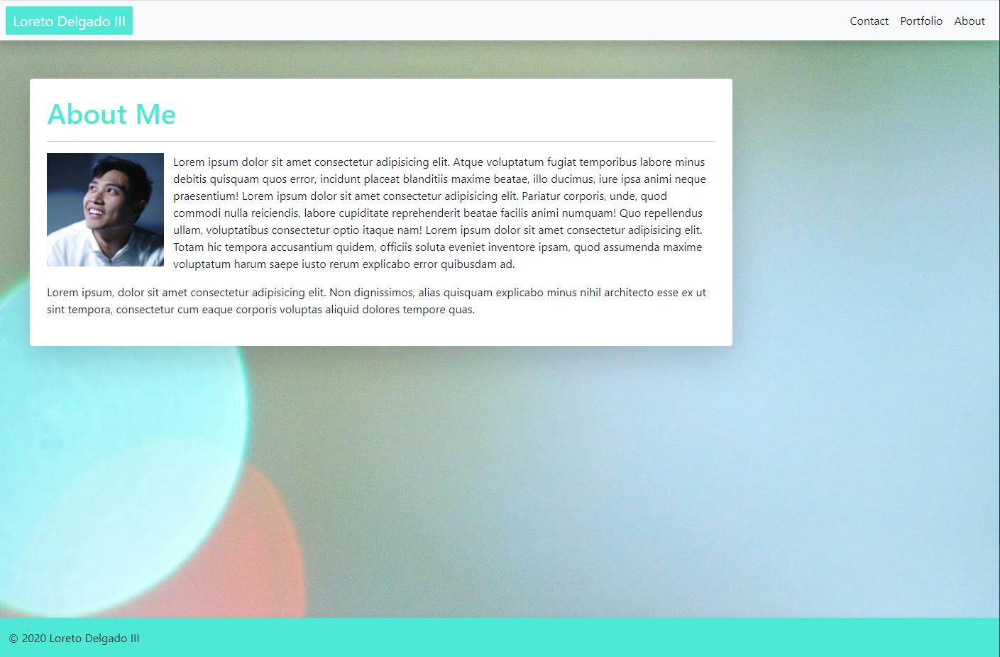
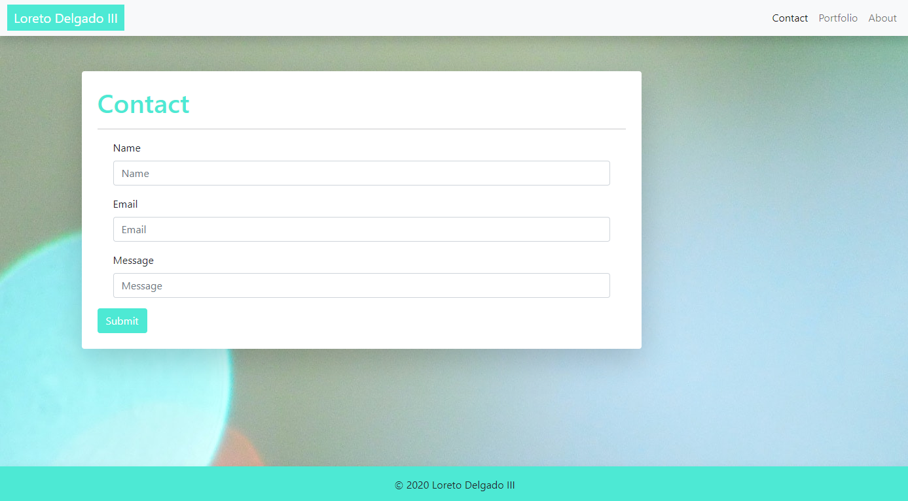
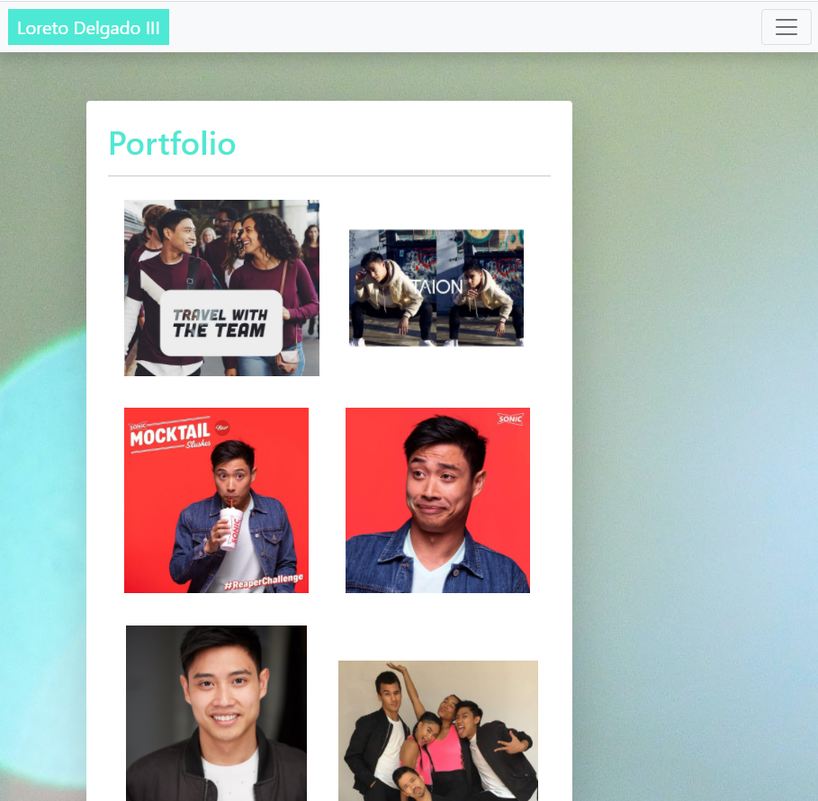

# Responsive-Portfolio

## Website Summary

Welcome to my website where you can preview my previous acting experience! By utilizing Bootstraps I was able to organize and stylize the different aspects of my page with greater efficiency and control. I came across the challenges of intially understanding how Bootstraps classes interacted, how to overide class styles, and formatting images with different dimensions. This page is currently able to take the user to three different webpages, direct them to social media platforms, and fill out contact information. In the future I would like to add the ability to take the information submitted on the contact page and utilize it for real-world application, like sending a message to the owner of the page (me). Ultimately, this was great practice for creating a website for future clients but also, great practice for implementing my own website to showcase my work.

## Wesbsite Images

## URL to Website

https://ldelgadoiii.github.io/Responsive-Portfolio/
